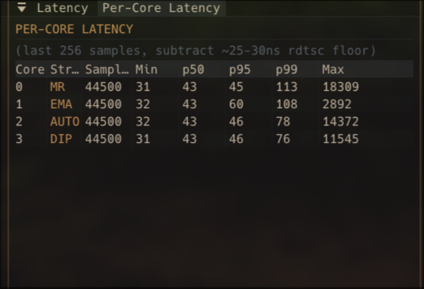

# Tick Trader — Per-Core Sharded Engine

per-core risk-sharded crypto trading engine in C++17. one position per pinned CPU, branchless fixed-point math, lock-free queues, seqlock-cached parameters. the hot path runs at single-digit ns/tick algorithmic floor — the slow path can do whatever (ML inference, regression, regime detection) without the executors ever paying for it.


> **measured on i9-9980HK, 4 cores, GUI running, no isolcpus, no chrt:**
> min 40 ns · p50 73-196 ns · p95 261-538 ns · **p99 494-912 ns** · max 1.0-4.9 µs
>
> rdtsc bracket overhead is ~8 ns on this CPU, so real per-tick work sits around **32-40 ns** in live multi-threaded execution. single-thread cache-resident algorithmic floor is **11.56 ns/tick** (see bench table below).

### best p99 observed in live trading (post-v4.7.5)



> **44,500 samples per core, live Binance feed, GUI rendering at the same time:**
> Core 3 SimpleDip · p99 = **76 ns** · subtract ~25–30 ns rdtsc floor → effective **~46 ns p99**
>
> Core 2 AUTO (regime-resolved) · p99 = **78 ns**
> Core 0 MR · p99 = 113 ns · Core 1 EMA · p99 = 108 ns
>
> p50 across all cores: 43 ns raw → ~13 ns effective. measured on i9-9980HK (Coffee Lake H, 2.4 GHz base / 5.0 GHz turbo, 2018-2019).

built from scratch, self-taught, ~60k lines across engine + backtest suite + ML pipeline. reusable primitives extracted as a public C++20 header-only library: [**FoxLIB**](https://github.com/Jennyfirrr/FoxLIB).

[](https://www.paypal.com/ncp/payment/8M6XLK7M8569C) [](https://discord.gg/asSDcYwPz)

> **paper trading by default.** live trading via Binance REST API is supported but experimental — use at your own risk. set `use_real_money=1` and add API keys to `secrets.cfg`. no API key needed for market data feeds.

---

## why these numbers matter

raw nanoseconds are abstract. context for what 500 ns p99 buys you:

| operation | latency |
|---|---:|
| `getpid()` syscall | 50–100 ns |
| memory barrier (`mfence`) | 30–50 ns |
| cross-core cache line bounce (HITM) | 50–100 ns |
| L3 cache hit | 10–15 ns |
| local DRAM access | 80–100 ns |
| **this engine, full gate eval p99 (no isolation)** | **500–900 ns** |
| TCP loopback round-trip | ~10–20 µs |
| `recvmsg()` through kernel network stack | 1–5 µs |
| DPDK userspace networking | 1–3 µs |
| typical exchange round-trip (colocated) | 20–100 µs |

end-to-end gate evaluation p99 in 500–900 ns on a desktop laptop with no kernel bypass is in the same neighborhood as commercial HFT engines. the p99 tail is mostly kernel preemption (scheduler stealing timeslices), not the algorithm — `chrt -f 90 taskset -c 4-7` would flatten it into the low-100s.

## architecture

```
HOT PATH (every tick, per-core, ~30-40 ns measured work):
  ExecutionCore_Tick (pinned to one CPU)
    ↓ acquire-load: ParameterSlot.seq
    ↓ if cached_seq matches → skip the 192B parameter memcpy
    ↓ branchless BG/SG evaluation (4 FPN comparisons)
    ↓ on entry/exit: push TradeEvent → SPSC ring

SLOW PATH (every ~256 ticks, controller core):
  ↓ RollingStats (least-squares regression, R², variance)
  ↓ RegimeSignals (7 features, score-based classifier)
  ↓ ML inference (XGBoost/LightGBM single-row, ~1-5 µs)
  ↓ Strategy_BuildParameters → GateParameters
  ↓ ParameterSlot_Write (seqlock, wait-free producer)

CONTROLLER (drainer thread):
  ↓ pops trade events from all cores' SPSC rings
  ↓ routes through Order Management System
  ↓ portfolio mutation via extracted fill handler

ORDER MANAGEMENT SYSTEM:
  three SPSC rings: REST fills, WebSocket fills, reconciliation
  async submission via BinanceAdapter worker thread
  idempotency keys, error-aware retry, rate limit tracking
  binary event log with disk persistence + deterministic fold

GUI (Dear ImGui, SDL2/OpenGL3):
  double-buffered TUISnapshot from producer thread
  per-core buy gate overlays on price chart
  per-strategy settings panel with hot-swap
```

the key insight: **the hot path is immune to model complexity.** XGBoost, LightGBM, LSTM, no model — the executor cores see only the resulting `GateParameters` struct. swap the model, the per-tick cost is unchanged.

## the seqlock postmortem (one war story)

the original design called for a triple buffer between the slow-path producer and the per-core executors. wait-free, lock-free, three slots, atomic index swap. textbook.

then phase 5 stress test produced torn reads at high producer rate. wrote the test, expected it to pass, didn't. the triple buffer had a race window when the producer wrote a new slot while a consumer was mid-read of the slot the producer was about to claim. classic ABA-adjacent.

switched to a [seqlock](https://en.wikipedia.org/wiki/Seqlock) — same pattern Linux kernel uses for `seqcount_t`. wait-free producer increments the seq counter, writes the payload, increments again. lock-free consumer reads seq, reads payload, re-reads seq, retries on mismatch.

the catch: on a 192-byte payload, the byte-level read during a producer write IS technically a data race. ThreadSanitizer correctly flags it. the fix is `__attribute__((no_sanitize("thread")))` on the read path — same annotation Linux uses, because that race is the whole point of the seqlock invariant.

```cpp
// see ParameterSlot.hpp comment block for the full reasoning
__attribute__((no_sanitize("thread")))
static inline bool ParameterSlot_Read(...) {
    uint32_t seq1 = atomic_load(&slot->seq, memory_order_acquire);
    if (seq1 & 1) return false;       // producer mid-write
    memcpy(out, &slot->params, sizeof(*out));
    uint32_t seq2 = atomic_load(&slot->seq, memory_order_acquire);
    return seq1 == seq2;              // retry if changed
}
```

then we cached the parameter snapshot in the executor itself — every tick does one acquire-load of `seq`, compares against `cached_seq`, skips the memcpy on match. steady-state cost: **~1 ns**. miss path: ~6 ns. inferring a 192-byte cache miss out of the per-tick budget unless parameters actually changed.

moral: trust the stress test over the plan. the plan said triple buffer, the test said torn reads, the test won.

## measurement methodology

per-call `rdtsc` has a structural overhead — the bracket itself costs more than what you're measuring on a fast hot path. on this i9-9980HK, the rdtsc bracket overhead is **~8 ns** (it was ~27 ns on the older Ice Lake i5). a per-tick latency number that doesn't subtract this is wrong by 25–60%.

`bench_batch_floor.cpp` brackets `rdtsc` ONCE around N=1M iterations of `ExecutionCore_Tick` and divides. amortizes the rdtsc tax to ~0 and reports the actual steady-state per-tick work in nanoseconds:

| variant | ns/tick (i9-9980HK, perf governor) |
|---|---:|
| orig (full 192B memcpy every tick) | 13.35 |
| cached (skip memcpy on seq match) | 15.04 |
| cached_v2 (no local copy) | 13.08 |
| cached_v3 (branch for active state) | 12.95 |
| **floor (gates + permission load only)** | **11.56** |
| **abs floor (1 cmp + 1 atomic load)** | **2.94** |

the `floor` is the algorithmic limit — what the gate evaluation itself costs without parameter caching, exit overrides, or the active-state branch. the `abs floor` is the loop infrastructure ceiling: 14.7 cycles at 5 GHz for 1 FPN compare + 1 acquire load + loop overhead. the CPU isn't going to do this faster.

at 5 GHz, the 192-byte memcpy is basically free, so the cache optimization barely shows on this hardware. the wins compound on slower CPUs or under cache pressure — on the older Ice Lake i5, the same optimization saved ~10 ns/tick.

## per-core strategies

each execution core runs a different strategy with independent tuning:

```
core_0_strategy = simple_dip
core_0_risk_pct = 20.0

core_1_strategy = momentum
core_1_risk_pct = 5.0

core_2_strategy = ml
core_2_model_path = models/trend_model.xgb
core_2_risk_pct = 10.0

core_3_strategy = ema_cross
```

available strategies: `simple_dip`, `momentum`, `mean_reversion`, `ema_cross`, `ml`, `none`

per-strategy TP/SL overrides so different strategies get different tuning:
```
simpledip_tp_pct = 0.15
simpledip_sl_pct = 0.10
momentum_tp_mult = 3.0      # stddev multipliers, not percentage
momentum_sl_mult = 1.5
emacross_tp_pct = 0.20
```

risk allocation is per-core — one position per pinned CPU, no contention, no shared bitmap. portfolio aggregation is a slow-path concern, not a hot-path one.

## ML inference

cores running `strategy = ml` load an XGBoost or LightGBM model and run single-row inference on every slow-path cycle (~1–5 µs). 16 features packed from rolling stats: short/long slopes, R², variance, volume delta, VWAP deviation, regime signals.

train models in the foxml_suite backtest GUI, export to `.xgb`, point config at them. each core can load a different model — run an aggressive model on one core and a conservative model on another, each with its own risk allocation.

**ML never runs on the hot path.** the model produces gate parameters, the parameter slot ferries them across, the executor consumes them in single-digit ns. swap the model class entirely (XGBoost → LSTM → transformer → none) and the executor's per-tick cost doesn't change.

## trained model results

> **Status:** infrastructure shipped (Phase 7 prep). Numbers below get filled in when a model with non-zero validation Pearson r exists. Section is template-only until then.

### methodology

- **Walk-forward** for hyperparameter selection (purged temporal CV — train on `[0, t)`, test on `[t+buffer, t+buffer+horizon)`, advance, repeat). Per-fold metric: accuracy for binary/multiclass, Pearson r for regression. Aggregated as mean ± stddev across folds.
- **Held-out** for the unbiased generalization estimate. A locked portion (default 20%, configurable via `held_out_fraction`) is reserved BEFORE any tuning. Code refuses to peek without an explicit unlock + audit log (`HeldOutSplit_Unlock`). Final eval runs once with the WF-selected hyperparameters.
- **Generalization gap**: `|WF_mean_val - held_out|`. Threshold is `gap_acceptable_threshold` (default 0.05). Gap above threshold = WF was overfit despite per-fold OK numbers — model doesn't ship.
- **Reproducibility**: model bundles save `expected.cfg` capturing label_type, `held_out_fraction`, `gap_acceptable_threshold`, threshold values. Live engine logs these at load time so future-you sees the discipline values the model was trained under.

### walk-forward validation

| fold | train range | val range | metric | overfit? |
|------|-------------|-----------|--------|----------|
| 1/5  | TBD         | TBD       | TBD    | TBD      |
| 2/5  | TBD         | TBD       | TBD    | TBD      |
| ...  |             |           |        |          |

- Mean validation metric: TBD
- Train/val gap: TBD
- Folds flagged as overfit: TBD/5

### held-out test

- Held-out fraction: 0.20 (last 20% of dataset, ~2 months of 12-month BTCUSDT)
- Held-out metric: TBD
- WF → held-out gap: TBD
- Gap acceptable threshold: 0.05
- **Verdict: TBD** (PASS = gap < threshold; FAIL = gap ≥ threshold, model doesn't ship)

### strategy comparison

| strategy | total P&L (%) | Sharpe | max DD (%) | win rate (%) |
|----------|---------------|--------|------------|--------------|
| SimpleDip (vanilla)      | TBD | TBD | TBD | TBD |
| SimpleDip + ML gate      | TBD | TBD | TBD | TBD |

### equity curve

[screenshot placeholder — fill from Compare panel after held-out evaluation]

### reproducibility

- Model fingerprint: TBD (SHA256 of training cfg + data)
- Config bundle: `models/{run_name}/expected.cfg`
- Data: BTCUSDT aggTrades, [start_date] – [end_date]
- Engine version: TBD (see `Version.hpp`)
- Tag at release: TBD

## order management system (OMS)

8 phases, all shipped:

| phase | what |
|-------|------|
| 01 | order state machine (PENDING → SUBMITTED → FILLED/REJECTED) |
| 02 | async REST submission via BinanceAdapter (drainer never blocks) |
| 03 | order event log + portfolio fold (deterministic replay) |
| 04 | user data websocket (real-time fills, 10–50 ms instead of REST 50–200 ms) |
| 05 | reconciliation poller (self-healing balance verification) |
| 06 | idempotency keys, error codes, rate limits, listen key hardening |
| 07 | disk persistence (binary event log, survives restarts) |
| 08 | per-core strategy config |

three concurrent SPSC rings feed the OMS drainer: REST results, WebSocket fills, reconciliation corrections. each has exactly one producer and one consumer. no MPSC needed. drainer drains all three sequentially in `OrderManager_Tick`.

## build

```bash
# ANSI TUI (zero deps beyond OpenSSL)
cmake -B build -DUSE_NATIVE_128=ON && cmake --build build

# ImGui GUI (SDL2 + OpenGL3)
cmake -B build_gui -DUSE_IMGUI_GUI=ON -DUSE_NATIVE_128=ON && cmake --build build_gui

# with ML model support
cmake -B build_gui -DUSE_IMGUI_GUI=ON -DUSE_NATIVE_128=ON -DUSE_XGBOOST=ON && cmake --build build_gui

cd build_gui && ./engine_gui
```

requires: g++ (C++17), OpenSSL, CMake 3.14+. GUI adds SDL2 + OpenGL3. ML adds XGBoost C library (build from source — see [DOCS](DOCS/)).

## config

set `engine_mode = sharded` in engine.cfg. key settings:

```
engine_mode = sharded
num_execution_cores = 4
sharded_force_synthetic = 0    # 1 = offline testing with synthetic ticks
use_real_money = 0             # paper trading (default)

starting_balance = 10000.00
fee_rate = 0.10
risk_pct = 15.00               # default per-core risk (override with core_N_risk_pct)

take_profit_pct = 0.15         # shared TP (override per-strategy)
stop_loss_pct = 0.10           # shared SL (override per-strategy)
```

hot-reloadable with `R` in the GUI. per-core strategy and risk can be changed at runtime via the settings panel.

## tests

```bash
./build/controller_test                                              # 351 assertions
./build/depth_recorder_test                                          # 17 assertions (Phase 8a — depth recorder)
./experiments/per_core_sharding/build/test_oms                       # 9 OMS state machine tests
./experiments/per_core_sharding/build/test_oms_concurrent            # 4 TSan-validated stress tests
./experiments/per_core_sharding/build/test_order_event_log           # 8 event log fold tests
./experiments/per_core_sharding/build/test_event_log_head_to_head    # 27 mode 0 vs mode 1 assertions
./experiments/per_core_sharding/build/test_oms_phase04_06            # 31 WS fill + reconcile tests
./experiments/per_core_sharding/build/bench_batch_floor              # latency bench
```

concurrent tests run under `-DTSAN=ON` (separate build dir) to validate the lock-free patterns. the seqlock test catches torn reads at high producer rate; that's how the original triple buffer plan got rejected.

## what's still raw

honest TODOs:

- **strategy stubs in sharded mode** — only `simple_dip` is fully ported to `Strategy_BuildParameters`. MR / Momentum / EmaCross fall back to SimpleDip until ported (mechanical work, follows the SimpleDip pattern).
- **snapshot v11** — per-core state persistence across restarts. single-core snapshots load fine; sharded mode loses per-core fill state on restart.
- **testnet soak** — 24-hour live run with `use_real_money=1, use_testnet=1` to verify WS fills + reconciler drift + listen key refresh hasn't been done yet.
- **partial fills** — `ORDER_PARTIAL` state exists in the enum but the code goes straight to `FILLED`.
- **rejection reset** — executor stays in optimistic state after a failed order; needs a `CMD_REJECT` path to release the slot.

## license

dual-licensed: **AGPL-3.0-or-later** (see [LICENSE](LICENSE)) **or Commercial**.

personal use, learning, and paper trading are welcome and encouraged. commercial use, network-accessible deployment, or use for profit requires a commercial license — contact [jenn.lewis5789@gmail.com](mailto:jenn.lewis5789@gmail.com).

unauthorized use settlement: 100% of gross revenue from date of first unauthorized use (up to 10–15 years), full statutory damages under 17 U.S.C. § 504 (up to $150,000 per work for willful infringement). bounty: 50% of total settlement for reports leading to successful enforcement. see [BOUNTY.md](BOUNTY.md).

**copyright (c) 2026 Jennifer Lewis. all rights reserved.**

---

<a href="https://www.paypal.com/ncp/payment/8M6XLK7M8569C">
  
</a>
