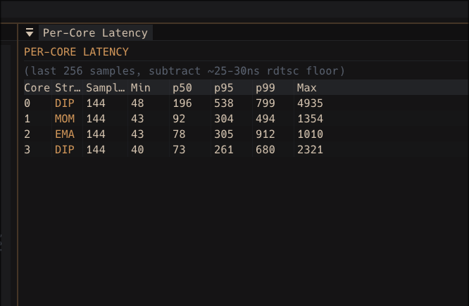
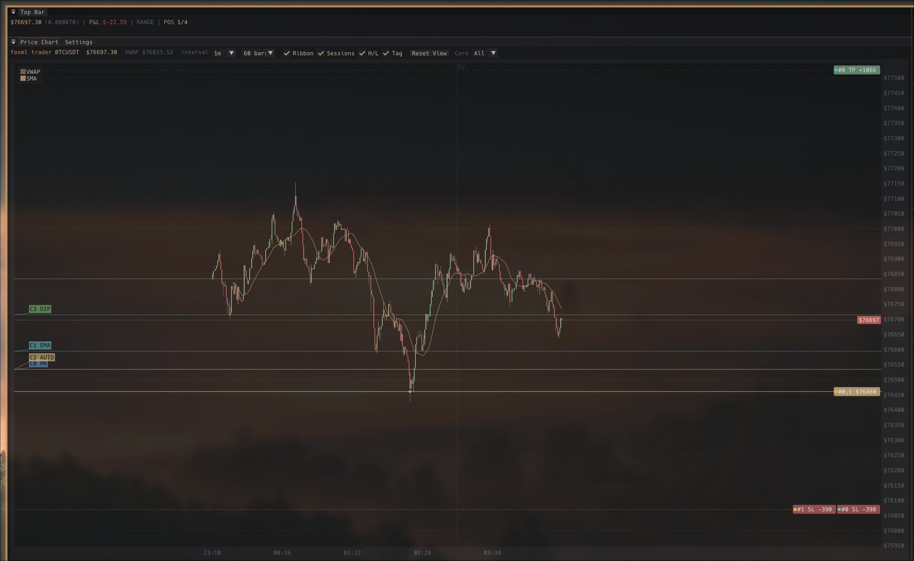
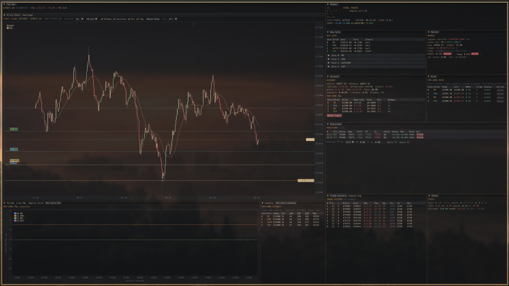

# Tick Trader — Per-Node Sharded Engine

per-node risk-sharded crypto trading engine in C++17. one position per pinned CPU, branchless fixed-point math, lock-free queues, seqlock-cached parameters. the hot path runs at single-digit ns/tick algorithmic floor — the slow path can do whatever (ML inference, regression, regime detection) without the executors ever paying for it.



> **measured live, GUI running, no isolcpus, no chrt, consumer hardware:**
> p50 hot-path: **30-40 ns real** (after subtracting ~25-30 ns rdtsc bracket overhead) · p99: **400-570 ns** · slow path p50: **90-100 µs** · slow path p99: **115-220 µs**
>
> single-thread cache-resident algorithmic floor: **11.56 ns/tick** (see `bench_batch_floor`). sub-100ns p50 on consumer hardware is in the same neighborhood as colo-tier HFT engines for similar branchless dispatch logic.

built from scratch, self-taught. reusable primitives extracted as a public C++20 header-only library: [**FoxLIB**](https://github.com/Jennyfirrr/FoxLIB).

**LOC breakdown** (the size that matters is the hot path, not the total):

| component | code LOC |
|---|---:|
| **hot path** (executor per-tick math: ExecutionCore + OrderGates + ParameterSlot) | **389** |
| engine (CoreFrameworks + Strategies + ML_Headers + DataStream + FixedPoint + MemHeaders) | 24,546 |
| backtest + training pipeline | ~11,000 |
| GUI (Dear ImGui panels) | ~7,400 |
| tests (1879 assertions) | ~17,800 |
| **total project** | **~89,000** |

The hot path is **0.4% of the project**. The rest is supporting infrastructure — training pipeline (so models get the right features), parity tests (so train + serve produce bytewise-identical output), backtest harness (so strategies validate before paper), GUI (so the operator sees what's happening), invariants tests (so future changes don't silently break load-bearing rules). All in service of keeping the executor tiny and trustworthy.

[](https://www.paypal.com/ncp/payment/8M6XLK7M8569C) [](https://discord.gg/asSDcYwPz)

> **paper trading by default.** live trading via Binance REST API is supported but experimental — use at your own risk. set `use_real_money=1` and add API keys to `secrets.cfg`. no API key needed for market data feeds.

---

## recent (v5.11.x)

- 🔬 **slow path 30x faster.** v5.11 sprint (9 phases, 65 sub-ships) collapsed slow-path p99 from ~3000µs to ~220µs. AVX-512 Bandit_GetProbabilities, FPN<F=64> end-to-end determinism, locale-immune parsing, allocator eradication, mmap arenas, async log writer, branchless ring buffer commit.
- 🤖 **multi-horizon ML ensemble.** Bandit-Exp3 weighted blend per regime over N horizons. Train multi-horizon at v5.11.41+; live engine auto-detects sibling `_horizon_<N>` dirs + per-regime bandit weights. Runtime IC drift detection auto-demotes degraded horizons.
- 🎯 **role-agnostic strategy** (v5.11.62). Strategy code never touches role names — adding a new model role is a 5-step procedure that doesn't change the strategy at all. Trains barrier 3-class, regression, binary buy_signal — all work transparently.
- 🛡 **train-serve parity locked** by FEATURE_REGISTRY_HASH + LABEL_REGISTRY_HASH + scaler_sha256 + HMAC stamp body. Cross-build / cross-cfg / cross-feature drift refused at engine load.
- 🔄 **hot model swap** without engine restart, safety-gated by open-position semantics.
- 1879 unit tests · 30+ snapshot parity tests · replay-determinism baseline

[full version history → `DOCS/CHANGELOG.md`](DOCS/CHANGELOG.md) · [per-sprint detail in `DOCS/changelogs/`](DOCS/changelogs/INDEX.md) · [GitHub releases](https://github.com/Jennyfirrr/FoxML_Trader_v2/releases)

---

## hire me

built this from the ground up — branchless fixed-point math, lock-free SPSC plumbing, per-core sharding, ML inference pipeline, regime detection, multi-horizon Bandit-Exp3 ensemble, train-serve parity infrastructure. self-taught. if you're building HFT, low-latency, or quantitative systems, i'd love to talk.

- email: jenn.lewis5789@gmail.com
- phone: 205-413-7057

— Jennifer Lewis

---

## what it looks like running



> live chart, BTCUSDT 1m bars. entry tags use `#core.leg` notation (`#0.A`, `#0.B`, etc.) matching the Positions panel. TP / SL lines extending across, per-core gate lines stacked on the left and staggered to avoid label collision. SMA ribbon, VWAP, EU session marker rendered together.



> 4 cores running different strategies (ML / DIP / AUTO / EMA), regime classifier active, partial exits paired across slots `#3.A` and `#3.B`, per-core latency panel, ML Ensemble panel showing per-horizon bandit weights per regime, account + risk panels with kill switch armed per core. all from a single tick stream fanned across SPSC rings.

---

## why these numbers matter

raw nanoseconds are abstract. context for what 500 ns p99 buys you:

| operation | latency |
|---|---:|
| `getpid()` syscall | 50–100 ns |
| memory barrier (`mfence`) | 30–50 ns |
| cross-core cache line bounce (HITM) | 50–100 ns |
| L3 cache hit | 10–15 ns |
| local DRAM access | 80–100 ns |
| **this engine, full gate eval p99** | **400–570 ns** |
| TCP loopback round-trip | ~10–20 µs |
| `recvmsg()` through kernel network stack | 1–5 µs |
| DPDK userspace networking | 1–3 µs |
| typical exchange round-trip (colocated) | 20–100 µs |

end-to-end gate evaluation p99 in 400–570 ns on a consumer laptop with no kernel bypass is in the same neighborhood as commercial HFT engines for branchless dispatch logic. p99 tail variance comes from kernel preemption — `chrt -f 90 taskset -c 4-7` + isolcpus would flatten it into the low-100s. see `DOCS/OPERATOR_DEPLOYMENT.md` for the deployment runbook.

---

## architecture

```
HOT PATH (every tick, per-core, ~30-40 ns measured work):
  ExecutionCore_Tick (pinned to one CPU)
    ↓ acquire-load: ParameterSlot.seq
    ↓ if cached_seq matches → skip the 192B parameter memcpy
    ↓ branchless BG/SG evaluation (4 FPN comparisons)
    ↓ on entry/exit: push TradeEvent → SPSC ring

SLOW PATH (per-core pthread, every poll_interval ticks):
  ↓ RollingStats (least-squares regression, R², variance)
  ↓ RegimeSignals (7 features → score-based classifier)
  ↓ ML inference (XGBoost single-row predict, ~1-5 µs)
  ↓ Strategy_BuildParameters → GateParameters
  ↓ ParameterSlot_Write (seqlock, wait-free producer)

PRODUCER (single thread):
  ↓ tick read from Binance WS (or backtest replay)
  ↓ fan_out across N per-core SPSC rings (one per engine)
  ↓ ema_price replication to each engine's slow_state
  ↓ GUI snapshot publish

DRAINER (single thread):
  ↓ pops trade events from all cores' SPSC rings
  ↓ drains per-core OMS submit queues (sole OMS_Submit caller)
  ↓ routes through Order Management System
  ↓ portfolio mutation via extracted fill handler

GUI (Dear ImGui, SDL2/OpenGL3):
  double-buffered TUISnapshot from producer thread
  per-core buy gate overlays, ML Ensemble panel, settings hot-swap
```

**The key insight: the hot path is immune to model complexity.** XGBoost, LightGBM, transformer, no model — the executor cores see only the resulting `GateParameters` struct. swap the model, the per-tick cost is unchanged.

---

## the seqlock story

original design: triple buffer between the slow-path producer and per-core executors. wait-free, lock-free, three slots, atomic index swap. textbook.

stress test produced torn reads at high producer rate. switched to a [seqlock](https://en.wikipedia.org/wiki/Seqlock) — same pattern Linux kernel uses for `seqcount_t`. wait-free producer increments the seq counter, writes payload, increments again. lock-free consumer reads seq, payload, re-reads seq, retries on mismatch.

cached the parameter snapshot in the executor itself — every tick does one acquire-load of `seq`, compares against `cached_seq`, skips the memcpy on match. steady-state cost: **~1 ns**. miss path: ~6 ns.

trust the stress test over the plan. plan said triple buffer, test said torn reads, test won. full reasoning in `CoreFrameworks/ParameterSlot.hpp`.

---

## measurement methodology

per-call `rdtsc` has structural overhead — the bracket itself costs more than what you're measuring on a fast hot path. on this CPU, the rdtsc bracket overhead is **~25-30 ns**. a per-tick latency number that doesn't subtract this is wrong by 25-60%.

`bench_batch_floor.cpp` brackets `rdtsc` ONCE around N=1M iterations of `ExecutionCore_Tick` and divides — amortizes the rdtsc tax to ~0:

| variant | ns/tick (measured) |
|---|---:|
| orig (full 192B memcpy every tick) | 13.35 |
| cached (skip memcpy on seq match) | 13.08 |
| **floor (gates + permission load only)** | **11.56** |
| **abs floor (1 cmp + 1 atomic load)** | **2.94** |

the `floor` is the algorithmic limit — what gate evaluation costs without parameter caching. the `abs floor` is the loop infrastructure ceiling. the CPU isn't going to do this faster.

---

## ML pipeline

cores running `core_N_strategy=ml` load XGBoost models via `core_N_model_dir=<base_path>`. engine auto-detects multi-horizon siblings (`<base>_horizon_<N>/`) and runs Bandit-Exp3 weighted blend per regime.

**training:** foxml_suite GUI runs walk-forward CV + held-out validation + auto-stamp. label kinds: binary buy_signal, 3-class barrier (PEAK_VALLEY_STABLE), regression. multi-horizon training writes per-horizon model files; live engine auto-detects.

**ML never runs on the hot path.** model produces gate parameters at slow-path cadence; executor consumes them in single-digit ns. swap model class entirely — hot path cost unchanged.

train-serve parity locked via:
- `FEATURE_REGISTRY_HASH` (FOREACH_FEATURE X-macro fingerprint)
- `LABEL_REGISTRY_HASH` (FOREACH_TARGET X-macro fingerprint)
- `scaler_sha256` (FeatureStandardizer sidecar binding)
- HMAC-signed stamp body (cross-build / cross-cfg / cross-feature drift refused)

see [`DOCS/ML_TRAINING.md`](DOCS/ML_TRAINING.md) + [`DOCS/ML_USAGE.md`](DOCS/ML_USAGE.md) for the operator-facing pipeline.

---

## build

```bash
./build.sh test     # ANSI TUI engine + controller_test (1879 tests)
./build.sh gui      # ImGui GUI (engine_gui + foxml_suite)
./build.sh suite    # GUI + XGBoost training (requires xgboost C lib)
./build.sh tsan     # ThreadSanitizer build
./build.sh asan     # AddressSanitizer build
./build.sh all      # everything
```

requires: g++ (C++17), OpenSSL, CMake 3.14+. GUI adds SDL2 + OpenGL3. ML adds XGBoost C library (build from source — see `DOCS/QUICKSTART.md`).

---

## config

```ini
# engine.cfg — minimal example
engine_mode = sharded
num_execution_cores = 4
use_real_money = 0               # paper trading (default)

starting_balance = 10000.00
fee_rate_taker = 0.00100
risk_pct = 5.00                  # per-core risk %

# per-core strategy + ML model
core_0_strategy = ml
core_0_model_dir = models/classification/my_run
core_0_disabled_horizons = 1000  # CSV; freeze underperforming horizons

# train-serve parity gate
held_out_gate_strict = 0         # 0 = warn-only, 1 = refuse on stamp failure
held_out_stamp_secret =          # HMAC secret (empty = devmode)
gap_acceptable_threshold = 0.05  # WF/held-out gap that fails the stamp
```

hot-reloadable with `r` in the TUI. per-core strategy and risk can be changed at runtime via the Settings panel. full reference: `DOCS/CONFIGURATION.md`.

---

## tests

```bash
./build/controller_test           # 1879 assertions
./build/depth_recorder_test       # depth recorder
./build/parity_harness            # legacy single_core ↔ sharded backtest byte-identity
./build_lat/bench_batch_floor     # latency bench (rdtsc-bracketed)
```

`controller_test` covers engine + ML pipeline + OMS + reconcile + train-serve parity. `parity_harness` runs both engine paths on the same input and asserts byte-identical training data — pins train-serve symmetry by construction. seqlock test catches torn reads at high producer rate; that's how the original triple buffer plan got rejected.

ThreadSanitizer build (`./build.sh tsan`) validates lock-free patterns. AddressSanitizer (`./build.sh asan`) catches memory hazards.

---

## order management system

8 phases, all shipped:

| phase | what |
|---|---|
| 01 | order state machine (PENDING → SUBMITTED → FILLED/REJECTED) |
| 02 | async REST submission via BinanceAdapter (drainer never blocks) |
| 03 | order event log + portfolio fold (deterministic replay) |
| 04 | user data websocket (real-time fills, 10–50 ms instead of REST 50–200 ms) |
| 05 | reconciliation poller (self-healing balance verification) |
| 06 | idempotency keys, error codes, rate limits, listen key hardening |
| 07 | disk persistence (binary event log, survives restarts) |
| 08 | per-core strategy config |

three concurrent SPSC rings feed the OMS drainer: REST results, WebSocket fills, reconciliation corrections. each has exactly one producer and one consumer. drainer drains all three sequentially in `OrderManager_Tick`.

---

## documentation

| If you're... | Read |
|---|---|
| **New to the codebase** | [`CLAUDE.md`](CLAUDE.md) → [`DOCS/QUICKSTART.md`](DOCS/QUICKSTART.md) → architecture + build sections above |
| **Configuring the engine** | [`DOCS/CONFIGURATION.md`](DOCS/CONFIGURATION.md) — every cfg field documented |
| **Backtest / training operator** | [`DOCS/ML_TRAINING.md`](DOCS/ML_TRAINING.md) + [`DOCS/ML_USAGE.md`](DOCS/ML_USAGE.md) |
| **Going to live trading** | [`DOCS/OPERATOR_DEPLOYMENT.md`](DOCS/OPERATOR_DEPLOYMENT.md) — kernel tuning, isolcpus, SCHED_FIFO, IRQ affinity |
| **Profiling latency** | [`DOCS/LATENCY_PROFILING.md`](DOCS/LATENCY_PROFILING.md) — rdtsc methodology + bench guide |
| **Contributing** | [`DOCS/CONTRIBUTING.md`](DOCS/CONTRIBUTING.md) |
| **Looking for what shipped when** | [`DOCS/CHANGELOG.md`](DOCS/CHANGELOG.md) (one-line per version) · [`DOCS/changelogs/`](DOCS/changelogs/INDEX.md) (per-sprint forensic detail) |

> Internal architecture docs (load-bearing invariants, parity contracts, full code-map, sprint changelogs) are operator-private — they capture edge-case design history not relevant to public users. The source code is documented inline; CLAUDE.md is the always-loaded reference for engine-wide architecture.

---

## current state

- ✅ engine architecture, hot path, slow path, OMS, ML pipeline, GUI — all stable
- ✅ multi-horizon ensemble training + live deployment working end-to-end
- ✅ train-serve parity infrastructure complete (v5.9 hardening sprint + v5.11.62 role-agnostic refactor)
- ✅ paper trading on real Binance feed validated
- 🚧 live capital deployment — gated on disconnect-flatten policy + latency staleness gate (deferred work, ~1.5 days when triggered)
- 🚧 testnet 24-hour soak — pending before mainnet

unshipped roadmap items live in operator-private working notes (gitignored). [`DOCS/CHANGELOG.md`](DOCS/CHANGELOG.md) has the public per-version highlights.

---

## license

dual-licensed: **AGPL-3.0-or-later** (see [LICENSE](LICENSE)) **or Commercial**.

personal use, learning, and paper trading are welcome and encouraged. commercial use, network-accessible deployment, or use for profit requires a commercial license — contact [jenn.lewis5789@gmail.com](mailto:jenn.lewis5789@gmail.com).

unauthorized commercial use is enforced under AGPL-3.0 + standard copyright law. a finder's fee is available for credible reports of unlicensed commercial deployment that lead to a successful settlement — exact terms negotiated privately. see [BOUNTY.md](BOUNTY.md).

**copyright (c) 2026 Jennifer Lewis. all rights reserved.**

---

<a href="https://www.paypal.com/ncp/payment/8M6XLK7M8569C">
  
</a>
